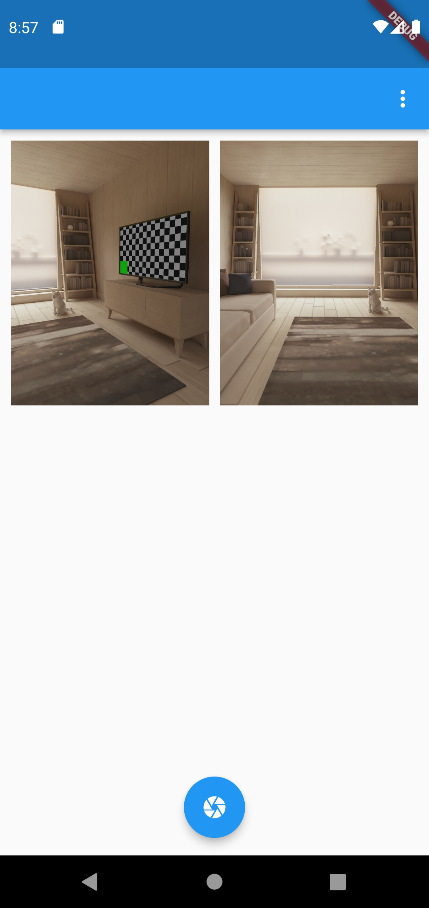
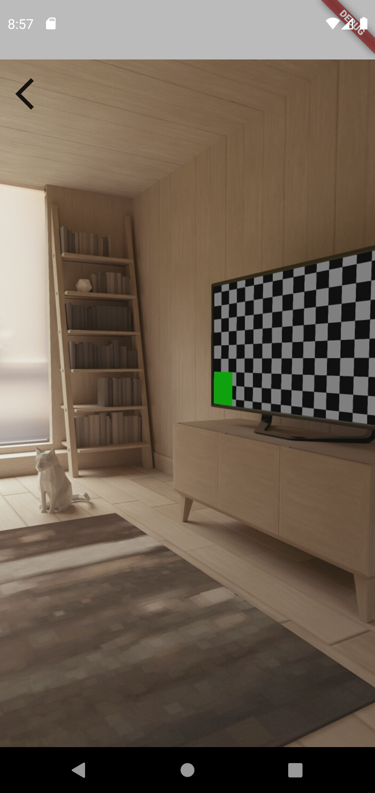

# camera_photo

I am happy to share with you my camera app.
use in acess camera and gallery.
[video link](https://www.linkedin.com/posts/muhdanjoom_flutter-flutterdeveloper-fluttercommunity-activity-7097114717130788864-3yUQ?utm_source=share&utm_medium=member_desktop) 

## ScreenShots

<table>
    <tr>
        <td></td>
        <td></td>
    </tr>
</table>

## Building

-Install Flutter
- `flutter pub get`
- `flutter run`

