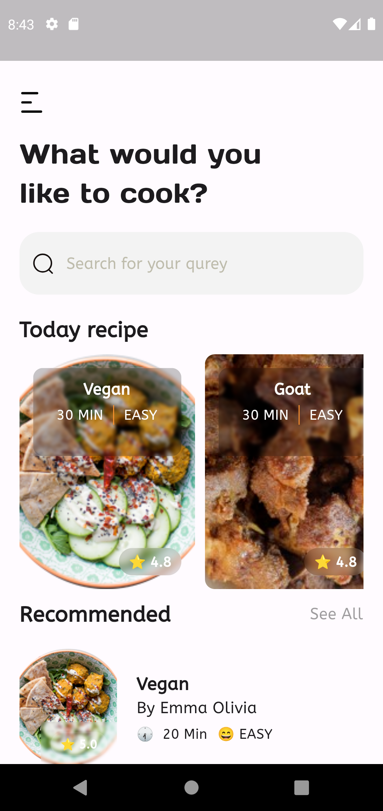
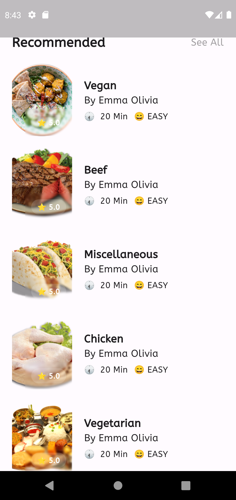
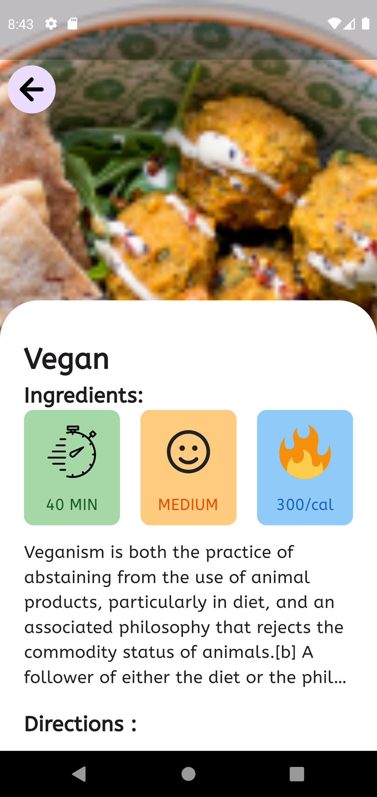

# meal_app

I am happy to share with you my api project in flutter, this meal app.
use in www.themealdb.com api.

## ScreenShots

<table>
    <tr>
        <td></td>
        <td></td>
    </tr>
    <tr>
        <td></td>
        <td></td>
    </tr>
</table>

## Building

-Install Flutter
- `flutter pub get`
- `flutter run`

